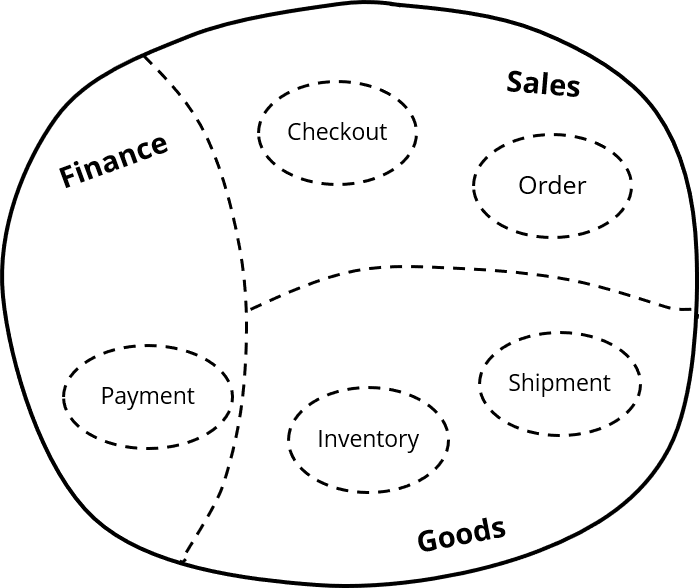
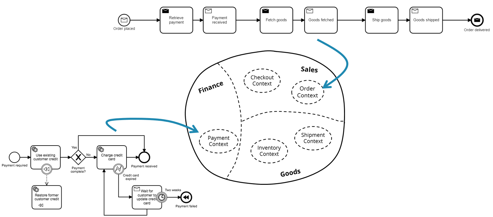

# Order fulfillment sample application demonstrating concepts in the context of DDD and Microservices. 

This sample application shows how to implement

* a simple order fulfillment system

in the context of

* Domain Driven Design (DDD)
* Event Driven Architecture (EDA)
* Microservices (µS)

**Note:** There is also an example demonstrating **stateful resilience patterns** when using REST communication. It contains an own readme for details: [payment-rest](payment-rest).

## Links

* Introduction blog post by Bernd Rücker: https://blog.bernd-ruecker.com/flowing-retail-demonstrating-aspects-of-microservices-events-and-their-flow-with-concrete-source-7f3abdd40e53
* InfoQ-Writeup "Events, Flows and Long-Running Services: A Modern Approach to Workflow Automation": https://www.infoq.com/articles/events-workflow-automation

# Overview

Flowing retail simulates a very easy order fulfillment system. The business logic is separated into the following services (shown as [context map](https://www.infoq.com/articles/ddd-contextmapping)):



## Concrete technologies/frameworks:

* Java
* Spring Boot
* Spring Cloud Streams
* Camunda
* Apache Kafka

## Architecture 

This results in the following architecture:


## Communication of services

The services have to collaborate in order to implement the overall business capability of order fulfillment. There are many possibilities to communicate, this example focues on:

* *Asynchronous* communication via Apache Kafka 
* *Event-driven* wherever appropriate
* Sending *Commands* in cases you want somebody to do something, which involves that events need to be transformed into events from the component responsible for, which in our case is the Order service:


## Potentially long running services and distributed orchestration

Typically long running services allow for a better service API. For example Payment might clear problems with the credit card handling itself, which could even involve to ask the customer to add a new credit card in case his is expired. So the service might have to wait for days or weeks, making it long running. This requires to handle state, that's why a state machine like Camunda is used.

An important thought is, that this state machine (or workflow engine in this case) is a library used *within* one service. It runs embedded within the Spring Boot application, and if different services need this, they run engines on their own. It is an autonomous team decision if they want to use some framework and which one:




# Run the application

You can either

* Docker Compose with pre-built images from Docker Hub (simplest)
* Build (Maven) and start via Docker Compose
* Build (Maven) and start manually (including Zookeeper, Kafka)

## Hint on using Camunda Enterprise Edition

For Camunda there is an enterprise edition available with [https://camunda.com/products/cockpit/#/features](additional features in Cockpit) (the monitoring tool). It is quite handy to use this when playing around with the example. You can easily switch to use enterprise edition:

* Get a trial license if you don't have a license yet: https://camunda.com/download/enterprise/
* Adjust Camunda version used in pom (order and payment use Camunda): ./order/pom.xml#L19, ./order/pom.xml#L69, ./payment/pom.xml#L13 and ./payment/pom.xml#L63
* Note that this only works if you build the projects locally, not with the pre-build images

Note that you do not need the enterprise edition to run the examples, the community edition will also do fine, you just cannot see and do that much in Camunda Cockpit.


## Docker Compose with pre-build Docker images

* Download [docker-dist/docker-compose.yml](docker-dist/docker-compose.yml) or clone the source code
* Goto directory where you downloaded this file 

```
cd docker-dist
```

* Start using docker compose:

```
docker-compose up
```

* After everything has started up you are ready to visit the overview page [http://localhost:8099](http://localhost:8099)
* You can place an order via [http://localhost:8090](http://localhost:8090)
* You can inspect insided of Order via [http://localhost:8091](http://localhost:8091)
* You can inspect insides of Payment via [http://localhost:8092](http://localhost:8092)
* You can inspect all events going on via [http://localhost:8095](http://localhost:8095)

If you like you can connect to Kafka from your local Docker host machine too. Because of so called advertised endpoints you have to map the Kafka container hostname to localhost. This is because the cluster manager of Kafka (Zookeeper) gives you his view of the Kafka cluster which containes of this hostname, even if you connected to localhost in the first place.

For example, on Windows append this entry to ```C:\Windows\System32\drivers\etc\hosts```:
```
127.0.0.1 kafkaserver
```

On Linix edit the ```/etc/hosts``` accordingly.


## Docker Compose with local build of Docker images

* Download or clone the source code
* Run a full maven build

```
mvn install
```

* Build Docker images and start them up

```
docker-compose build
docker-compose up
```

* After everything has started up you are ready to visit the overview page [http://localhost:8099](http://localhost:8099)
* You can place an order via [http://localhost:8090](http://localhost:8090)
* You can inspect insided of Order via [http://localhost:8091](http://localhost:8091)
* You can inspect insides of Payment via [http://localhost:8092](http://localhost:8092)
* You can inspect all events going on via [http://localhost:8095](http://localhost:8095)

If you like you can connect to Kafka from your local Docker host machine too. Because of so called advertised endpoints you have to map the Kafka container hostname to localhost. This is because the cluster manager of Kafka (Zookeeper) gives you his view of the Kafka cluster which containes of this hostname, even if you connected to localhost in the first place.

For example, on Windows append this entry to ```C:\Windows\System32\drivers\etc\hosts```:
```
127.0.0.1 kafkaserver
```

On Linix edit the ```/etc/hosts``` accordingly.

## Manual start (Kafka, mvn exec:java)

* Download or clone the source code
* Run a full maven build

```
mvn install
```

* Install and start Kafka on the standard port
* Create topic *"flowing-retail"*

```
kafka-topics.sh --create --zookeeper localhost:2181 --replication-factor 1 --partitions 1 --topic flowing-retail
```

* You can check & query all topics by: 

```
kafka-topics.sh --list --zookeeper localhost:2181
```

* Start the different microservices components by Spring Boot one by one, e.g.
    
```
mvn -f checkout exec:java
mvn -f order exec:java
...
```

You can also import the projects into your favorite IDE and start the following class yourself:

```
checkout/io.flowing.retail.java.CheckoutApplication
...
```

* Now you can place an order via [http://localhost:8090](http://localhost:8090)
* You can inspect insided of Order via [http://localhost:8091](http://localhost:8091)
* You can inspect insides of Payment via [http://localhost:8092](http://localhost:8092)
* You can inspect all events going on via [http://localhost:8095](http://localhost:8095)
